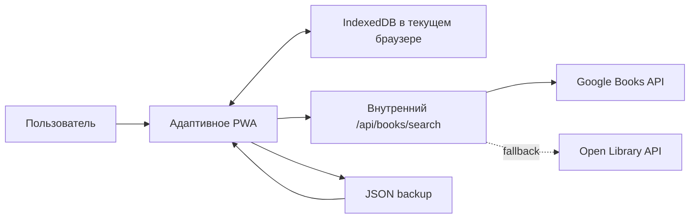

# Технический дизайн MVP

## 1. Архитектурный выбор

MVP — local-first адаптивное PWA на Next.js и TypeScript.

- **UI:** React, Next.js App Router, CSS custom properties и CSS Modules.
- **Локальные данные:** IndexedDB через Dexie.
- **Валидация:** Zod для форм, импортов, экспортов и ответов внешних каталогов.
- **Перестановка:** `dnd-kit` плюс отдельные кнопочные команды перемещения.
- **Графики:** лёгкая библиотека с доступным SVG либо собственные простые SVG-компоненты; окончательный выбор делается при реализации статистики.
- **Тестирование:** Vitest, Testing Library и Playwright.
- **PWA:** web manifest и service worker для app shell и офлайн-доступа к ранее загруженному приложению.

Next.js выбран вместо полностью статического клиента, потому что route handler позволяет обращаться к внешним книжным каталогам через единый внутренний API, нормализовать ответы, ограничивать запросы и не связывать интерфейс с конкретным поставщиком.

## 2. Контекст системы



Google Books используется как основной источник: официальный API поддерживает полнотекстовый поиск томов и возвращает метаданные изданий. Open Library подключается как fallback через отдельный адаптер. UI работает только с внутренней нормализованной моделью и не знает формат поставщика.

Официальные источники:

- https://developers.google.com/books/docs/v1/using
- https://openlibrary.org/dev/docs/api/search

## 3. Модель данных

### 3.1. Book

```ts
type BookStatus = "want_to_read" | "reading" | "read" | "paused" | "abandoned";
type BookFormat = "paper" | "ebook" | "audio";
type BookKind = "fiction" | "nonfiction";

interface Book {
  id: string;
  title: string;
  authors: string[];
  description?: string;
  cover?: CoverAsset;
  coverAlternatives: CoverAsset[];
  genres: string[];
  publicationYear?: number;
  language?: "ru" | "en" | string;
  kind: BookKind;
  status: BookStatus;
  formats: BookFormat[];
  isFavorite: boolean;
  manualOrder: number;
  spineTheme: SpineTheme;
  sourceRefs: SourceRef[];
  createdAt: string;
  updatedAt: string;
}
```

### 3.2. ReadingSession

```ts
interface ReadingSession {
  id: string;
  bookId: string;
  startedOn?: string;   // YYYY-MM-DD
  finishedOn?: string;  // YYYY-MM-DD
  rating?: number;      // integer 1..10
  answers: Record<string, string>;
  freeComment?: string;
  sequence: number;     // 1 = первое чтение, 2+ = перечитывание
  createdAt: string;
  updatedAt: string;
}
```

### 3.3. Supporting types

```ts
interface CoverAsset {
  kind: "remote" | "local";
  url?: string;
  blobId?: string;
  width?: number;
  height?: number;
  source?: string;
}

interface SpineTheme {
  background: string;
  foreground: string;
  accent: string;
  ornament: "stars" | "vines" | "runes" | "lines" | "none";
}

interface SourceRef {
  provider: "google-books" | "open-library" | "manual";
  externalId?: string;
}
```

### 3.4. Связи и инварианты

- `Book 1 — N ReadingSession`.
- У книги не более одной незавершённой активной записи.
- Статус `reading` предполагает активную запись; переход в него предлагает создать запись с датой начала.
- Завершение активной записи устанавливает `finishedOn` и статус `read`.
- Повторное чтение создаётся явной командой и увеличивает `sequence`; старая запись не клонируется и не меняется.
- `manualOrder` уникален в пределах локальной библиотеки. После перемещения значения перенумеровываются в одной транзакции; для личной библиотеки это проще и надёжнее дробных rank-ключей.

## 4. Хранилище

Таблицы Dexie:

- `books`: `id, manualOrder, status, *authors, *genres, publicationYear, createdAt`;
- `readingSessions`: `id, bookId, finishedOn, startedOn, rating, [bookId+sequence]`;
- `coverBlobs`: `id` для загруженных пользователем изображений;
- `settings`: `key`;
- `metadataCache`: `queryKey, expiresAt`.

Миграции IndexedDB версионируются. Экспорт имеет независимое поле `schemaVersion`, чтобы резервная копия могла пережить изменение внутренней схемы.

## 5. Поиск книг

Внутренний контракт:

```ts
interface BookSearchResult {
  source: "google-books" | "open-library";
  externalId: string;
  title: string;
  authors: string[];
  description?: string;
  covers: Array<{ url: string; width?: number; height?: number }>;
  genres: string[];
  publicationYear?: number;
  language?: string;
  isbn?: string[];
}
```

Поток:

1. Клиент ждёт короткую паузу после ввода и отправляет запрос от 2 символов.
2. Сервер запрашивает Google Books с `printType=books`, нормализует и ранжирует результаты.
3. При ошибке или отсутствии пригодных результатов сервер обращается к Open Library.
4. Дубли внутри выдачи объединяются по ISBN, а без ISBN — по нормализованным названию, автору и году.
5. Ошибка внешнего API возвращается как контролируемое состояние с предложением ручного ввода.
6. Секреты API существуют только на сервере. В production для ключа применяются ограничения по API и окружению.

## 6. Визуальные полки

### Корешки

- Полка — адаптивный ряд фиксированной высоты с книгами переменной ширины.
- На широком экране корешки переносятся в следующие ряды-полки.
- На узком экране каждый ряд остаётся в контейнере экрана; название сокращается визуально, но полностью доступно через `aria-label` и карточку.
- Палитра корешка извлекается из выбранной обложки серверным обработчиком при добавлении или смене обложки.
- Если изображение недоступно для анализа, тема выбирается детерминированно из согласованной палитры по хэшу `book.id`.

### Обложки

- CSS Grid с одинаковым горизонтальным интервалом и общей линией полки.
- Обложки используют единый визуальный bounding box, сохраняя исходное соотношение сторон через `object-fit: contain`.
- На ширине 360 px должно помещаться минимум две обложки в ряд.

### Порядок

- Новая книга получает `manualOrder = 0`, остальные позиции сдвигаются в транзакции.
- Фильтры меняют видимое подмножество, но не порядок скрытых книг.
- Перемещение при активном фильтре меняет относительный порядок видимых книг и сохраняет позиции невидимых предсказуемо; точный алгоритм покрывается unit-тестами.
- При активной временной сортировке перестановка отключена с понятным объяснением.

## 7. Состояния интерфейса

Каждая страница должна иметь состояния:

- первоначальная загрузка;
- пустое содержимое;
- частично заполненные данные;
- ошибка с восстановимым действием;
- офлайн;
- reduced motion.

Удаление требует подтверждения. Автосохранение показывает ненавязчивый статус «Сохранено» и не прерывает ввод.

## 8. Резервная копия

Формат — UTF-8 JSON:

```ts
interface LibraryBackup {
  schemaVersion: 1;
  exportedAt: string;
  app: "enchanted-library";
  books: Book[];
  readingSessions: ReadingSession[];
  settings: Record<string, unknown>;
  coverBlobs: Array<{ id: string; mimeType: string; base64: string }>;
}
```

Импорт выполняется в два шага: валидация и предпросмотр, затем явное подтверждение замены или объединения. Для MVP обязательна стратегия полной замены; объединение можно отложить, если оно заметно увеличит риск дублей.

## 9. Безопасность и приватность

- Дневники не отправляются книжным каталогам.
- Внешнему API передаётся только поисковая строка.
- Пользовательские обложки остаются локальными в MVP.
- HTML из внешних описаний очищается либо преобразуется в безопасный текст.
- Ограничиваются размер и MIME-типы загружаемых изображений и backup-файлов.
- В интерфейсе явно объясняется, что очистка данных браузера удалит библиотеку без резервной копии.

## 10. Тестовая стратегия

- **Unit:** расчёты статистики, длительность, порядок, фильтры, нормализация каталогов, миграции и backup schema.
- **Component:** десятизвёздочная оценка, дневники двух типов, фильтры, оба вида полок, команды перемещения.
- **Integration:** IndexedDB repositories, импорт/экспорт, переходы статусов и создание чтений.
- **E2E:** все сценарии из `acceptance.md` в desktop и mobile viewport 360×800.
- **Visual regression:** главная, пустая библиотека, обе полки, книга и статистика; отдельные эталоны с reduced motion.
- **Accessibility:** автоматические проверки axe плюс ручная клавиатурная проверка критических потоков.

## 11. Производительность

- Цель: библиотека из 1 000 книг остаётся пригодной для поиска, фильтрации и перестановки.
- Обложки загружаются лениво и имеют responsive sizes.
- Декоративные анимации не запускают постоянный React-render loop.
- Тяжёлые вычисления статистики мемоизируются по версии данных.
- App shell доступен офлайн после первого успешного открытия.

